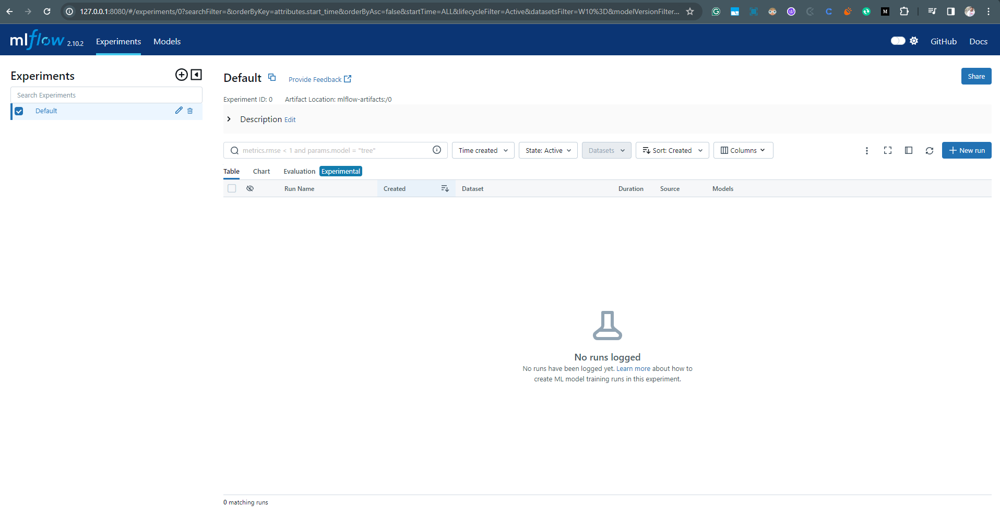
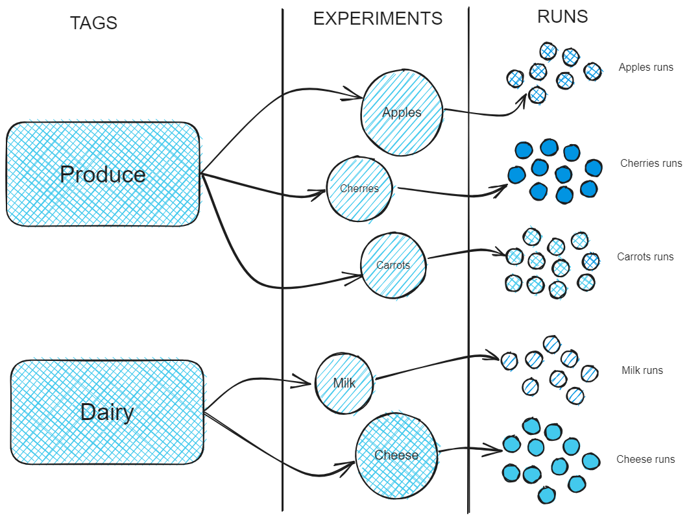
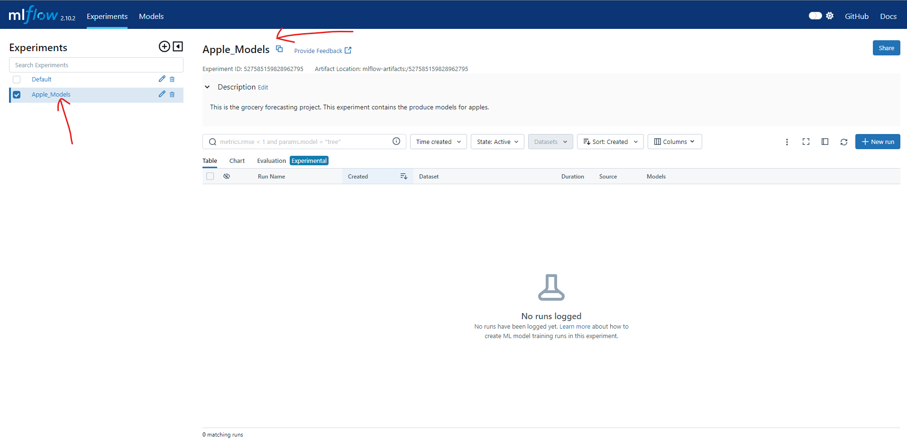

# Viewing Mlflow UI:
After running the mlflow server we can look mlflow UI at `http://<host-ip>:<port>`, if we are using our local environment we can redirect on `http://localhost:8080`. Note that http not https

Below is the mlflow UI and we can see there is no runs and only default experiment is present.


### Tag VS Experiments
Default experiments contains the runs without specific active experiments, however it is not recommended for regular use. Instead, creating unique experiments for specific collections of runs offer numerous advantages, as we'll explore now.

#### Benifts of defining Unique Experiments:
```1. Enhancing Organization:``` Experiments allow you to group related runs, making it easier to track and compare them. This is especially helpful when managing numerous runs, as in large-scale projects.

```2. Metadata Annotation:```
Experiments can carry metadata that aids in organizing and associating runs with larger projects.

## Scenario:
Consider a scenario: we are simulating the large demand forecasting project. This project involves building forecast models for various departments in achain of grocery stores, each housing numerous products. Our focus here is the `produce` department, which has several distinct items, each requires it's own forecast model.
Organising these models become paramount to ensure easy navigation and comparison.

## When should we define a experiment?
The main principle for creating an experiment is the consistency of the input data. If multiple runs using the same data or the portion of the data, they belongs to the same experiment. For other hierarchical categorizations, using _**`tags`**_ advisable

**Example:**

Consider the following structure of the models, mapped to the business product hierarchy:

```
Demand Forecasting Project
    ├── Dairy
    │   ├── Cheese
    │   │   ├── Parmesan
    │   │   └── Cheddar
    │   └── Milk
    │       ├── Whole
    │       └── 2%
    └── Produce
        ├── Fruit
        │   ├── Apples
        │   └── Cherries
        └── Vegetables
            └── carrot
```
Here `Dairy` and `Produce` are the part of the same project, but  they rely on distinct datasets amd will likely produce different model metrics. _Grouping the departments together definetly doesn't make sense._

Here temptation might arise that group all the produce together such as Apple,cherries and carrot in single experiments could dilute the effectiveness of run comparision within that experiment.
Thus it is essential to demacrate clear boundaries for your experiments to ensure meaningful insights.

### NOTE:
While the business product hierarchy in this case doesn't explicitly needs to be captured within the tag, there is nothing preventing you doing this. There isn't a limit to the number of tags that you can apply. Provide that the keys being used are consistent across experiments and runs to permit search to function properly, any number of arbitrary mapping between tracked modes and your specific business rules can be aplied.

To apply these boundaries effectively, as is shown in the figure below, tags should be employed.



### Example:
**Creating the Apples Experiment with Meaningful tags:**
```python
# Provide an Experiment description that will appear in the UI
experiment_description = (
    "This is the grocery forecasting project. "
    "This experiment contains the produce models for apples."
)

# Provide searchable tags that define characteristics of the Runs that
# will be in this Experiment
experiment_tags = {
    "project_name": "grocery-forecasting",
    "store_dept": "produce",
    "team": "stores-ml",
    "project_quarter": "Q3-2023",
    "mlflow.note.content": experiment_description,
}

# Create the Experiment, providing a unique name
produce_apples_experiment = client.create_experiment(
    name="Apple_Models", tags=experiment_tags
)

```
This above code will create a new experiment and we can see it:


Now we will take a look on these `tags` in the `mlflow UI` and we will see the power of these tags in the experiments and how `these tags simplifies the access to experiments that are the part of the large project.`

# Importatnt Note:
we can `create experiments` using direct `mlflow` also we can use `client api` for the same.

`mlflow.create_experiment()` and `client.create_experiment()` are both methods used to create experiments in MLflow, but they are accessed through different modules and have slightly different usage patterns:

**mlflow.create_experiment():**

This method is accessed directly from the mlflow module.
It is a convenience function provided by MLflow for creating experiments.
It can be used when you want to create an experiment without explicitly creating an instance of MlflowClient.
It returns the experiment ID of the newly created experiment.

_Example:_
```python
import mlflow
mlflow.create_experiment("my_experiment")

```
**client.create_experiment():**

This method is accessed through an instance of MlflowClient.
It is part of the MlflowClient API, which allows you to interact with the MLflow tracking server programmatically.
It is used when you want more control over the interaction with the tracking server, such as setting additional parameters or handling exceptions.
It returns an Experiment object representing the newly created experiment, which contains metadata about the experiment.
_Example:_
```python
from mlflow.tracking import MlflowClient
client = MlflowClient()
client.create_experiment("my_experiment")
```

_*In summary, mlflow.create_experiment() is a convenient way to create experiments without explicitly creating a client instance, while client.create_experiment() provides more flexibility and control over the creation process through the MlflowClient API. Both methods serve the same purpose of creating experiments in MLflow.*_