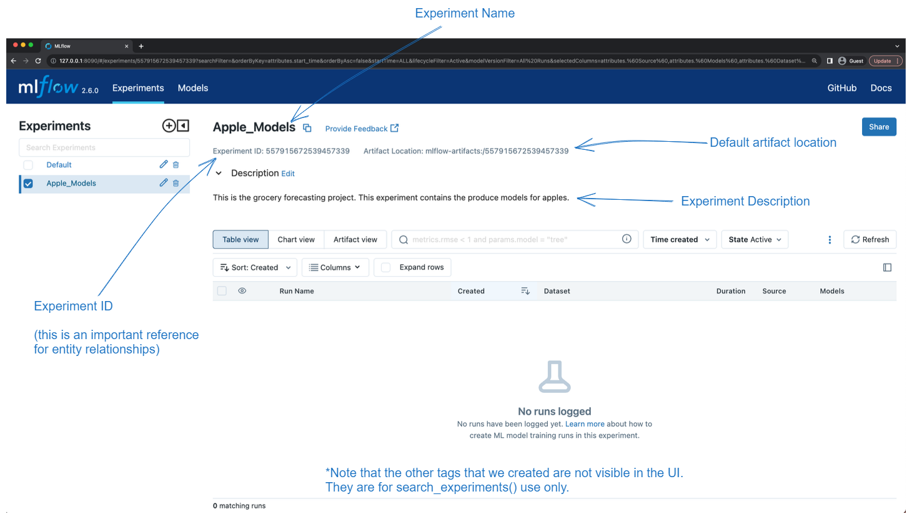
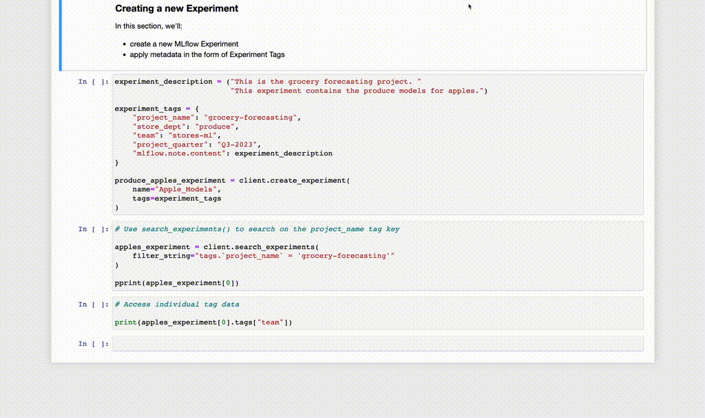

# Searching Experiments
In previous section we have created our first MLflow Experiments and providing custom tags so that we can find co-related Experiments that are part of large projects.

here we will see how to perform those searches with the mlflow client API.

Before we perform the search, let's take a look at out `Apple_Models` experiment in the UI.


## Importatnt component to be aware of in the UI:


## Searching based on tags
The search feature in MLflow allow users to be efficiently locate experiments based on specific tags assigned to them.
By filtering using the `search_experiments` API, user can find experiments that match custom tag values.

Custom tags serve as descriptors for experiments, enabling users to categorize and group them according to relevant criteria. When searching, users can specify criteria such as custom tag values to narrow down the results.

The syntax for filtering involves nuancens: named entities can be directly referenced, while custom tag name can be enclosed within bracket('), and search wuery can be enclosed with single quotes.

Example:
```python
# Use search_experiments() to search on the project_name tag key
apples_experiment = client.search_experiments(
    filter_string="tags.`project_name` = 'grocery-forecasting'"
)

print(vars(apples_experiment[0]))

output(The metadata associated with a created Experiment):
{'_experiment_id': '527585159828962795', '_name': 'Apple_Models', '_artifact_location': 'mlflow-artifacts:/527585159828962795', '_lifecycle_stage': 'active', '_tags': {'mlflow.note.content': 'This is the grocery forecasting project. This experiment contains the produce models for apples.', 'project_name': 'grocery-forecasting', 'project_quarter': 'Q3-2023', 'store_dept': 'produce', 'team': 'stores-ml'}, '_creation_time': 1708698099360, '_last_update_time': 1708698099360}
```
`NOTE: The returned results above are formatted for legibility. This return type is an Experiment object, not a dict.`



Next we will use the above experiment to log training data to runs that are associated with this experiment